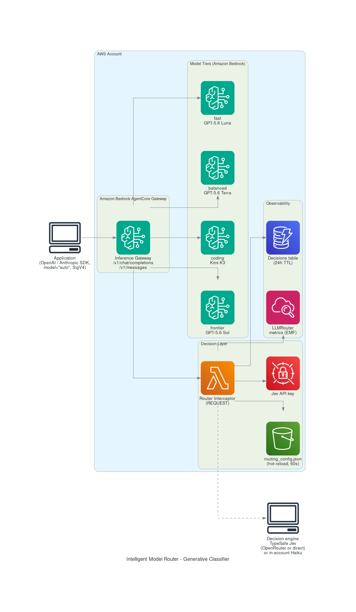

# Intelligent Model Router — Generative Classifier

Route every LLM request to the cheapest model that can handle it — automatically, in ~250ms, with zero quality downgrades on hard prompts.

Applications send requests to an OpenAI- or Anthropic-compatible endpoint with `model: "auto"`. A decision engine classifies each prompt (task type across 19 classes, complexity, reasoning need — with calibrated confidence) and a deterministic policy maps the classification to a model tier. Measured on a 585-prompt labeled benchmark: **94.9% routing accuracy, 56% token-spend reduction vs. always-frontier, zero dangerous downgrades** (see [eval/RESULTS.md](eval/RESULTS.md)).



## How it works

1. Your app calls the gateway endpoint (`/v1/chat/completions` or `/v1/messages`) with `model: "auto"`, signed with SigV4 (service `bedrock-agentcore`).
2. An Amazon Bedrock AgentCore Gateway **REQUEST interceptor** (Lambda) extracts the prompt and asks the decision engine three typed questions: what kind of task is this, how complex, does it need deep reasoning — each answer with calibrated confidence.
3. A deterministic policy resolves a tier: task → base tier, complexity can escalate one tier, low confidence fails **up** (never down).
4. The interceptor rewrites `model: "auto"` to the tier's concrete model; the gateway routes to Amazon Bedrock. Streaming (SSE) passes through.
5. Every decision is logged to DynamoDB (24h TTL) and CloudWatch metrics (namespace `LLMRouter`).

All routing behavior lives in one operator-editable file — `routing_config.json` in S3 — with ~60s hot-reload, validate-on-load, and last-known-good fallback. Add a task class, change a tier ladder, or swap the decision engine without redeploying.

## Decision engines

| Engine | Accuracy (holdout) | Latency p50 | Cost /1k decisions | Notes |
|---|---|---|---|---|
| `jev` (default) | 94.9% | 224ms | ~$0.02 | TypeSafe Jev decision model. Endpoint configurable: OpenRouter or TypeSafe direct. Prompt text transits the external API. |
| `bedrock` | 93.8% | 958ms | ~$1 | Claude Haiku classifier. Fully in-account — choose this if prompts must not leave AWS. |

Switch with the `DecisionEngine` stack parameter or the `engine` key in `routing_config.json`.

## Prerequisites

- AWS CLI v2, Python 3.9+ with pip
- A region where Bedrock AgentCore Gateway inference targets are available (verified: `us-east-1`)
- Bedrock model access enabled for the models in your routing ladders (defaults: GPT-5.6 Luna/Terra/Sol, Kimi K3/K2.5, Claude Sonnet 5/Opus 4.8 — all via cross-region inference profiles)
- For the `jev` engine: an API key for [OpenRouter](https://openrouter.ai) or TypeSafe

## Deploy

```bash
git clone https://github.com/mkiem/int-model-router-gen-classifier.git
cd int-model-router-gen-classifier

# Option A: Jev engine (recommended)
JEV_API_KEY=sk-... ./deployment/deploy.sh

# Option B: fully in-account (no external calls)
DECISION_ENGINE=bedrock ./deployment/deploy.sh
```

The script packages the Lambdas, deploys the CloudFormation stack, and uploads the default routing configuration. Outputs include the two endpoint URLs. Teardown: `./deployment/undeploy.sh` (removes everything, including the gateway and the versioned config bucket).

### Jev endpoint options

| | Endpoint | Model |
|---|---|---|
| OpenRouter (default) | `https://openrouter.ai/api/alpha/decisions` | `typesafe/jev-1.13` |
| TypeSafe direct | `https://api.typesafe.ai/v1/systemone` | `jev-1.13.0` |

```bash
JEV_ENDPOINT=https://api.typesafe.ai/v1/systemone JEV_MODEL=jev-1.13.0 JEV_API_KEY=... ./deployment/deploy.sh
```

## Use

```python
import boto3, json
from botocore.auth import SigV4Auth
from botocore.awsrequest import AWSRequest
from botocore.httpsession import URLLib3Session

URL = "<ChatCompletionsUrl stack output>"
creds = boto3.Session().get_credentials().get_frozen_credentials()
req = AWSRequest(method="POST", url=URL, headers={"Content-Type": "application/json"},
    data=json.dumps({"model": "auto", "max_tokens": 500,
                     "messages": [{"role": "user", "content": "Explain this regex: ^\\d+$"}]}))
SigV4Auth(creds, "bedrock-agentcore", "us-east-1").add_auth(req)
r = URLLib3Session().send(req.prepare())
print(json.loads(r.content)["model"])   # -> the routed model, e.g. global.openai.gpt-5.6-luna
```

Callers need IAM permission on the gateway ARN (stack output `GatewayArn`). OpenAI/Anthropic SDKs work too — point `base_url` at the gateway and sign requests (or front it with your own authed proxy).

## Operate

- **Routing config**: edit `s3://<stack>-config-<account>/routing_config.json`. Task classes, criteria wording, tier ladders per API family, escalation map, thresholds, engine choice. Invalid edits are rejected at load; the router keeps the last good config.
- **Decisions**: DynamoDB table `<stack>-decisions` — engine, task, tier, chosen model, confidence, overhead per request.
- **Metrics**: CloudWatch namespace `LLMRouter` — decision latency, tier distribution, config-load failures.
- **Fail-open**: if the decision engine is unreachable, requests route to the frontier tier (quality preserved, cost sacrificed) rather than failing.

## Evaluation

The benchmark that produced the accuracy numbers ships in [`eval/`](eval/): 585 labeled prompts across 19 task classes, a locked scoring policy, and the runner (`run_eval.py`). Four engines were compared, including an embedding-similarity router (Bifrost method) which scored 23% — embeddings measure what a prompt is about, not how hard it is. Full analysis: [eval/RESULTS.md](eval/RESULTS.md).

## Cost

Fixed: ~$0 idle (Lambda, DynamoDB on-demand, S3 — all pay-per-use; no provisioned infrastructure). Per-request: decision engine (~$0.00002 jev) + routed model tokens. At 100k requests/month with the measured 56% savings, the router pays for itself roughly 500× over.

## Security

- Gateway auth: AWS IAM (SigV4). No public endpoints.
- Jev API key in Secrets Manager; never in code or config.
- Router Lambda: least-privilege (config read, decisions write, metrics, secret read).
- With `DecisionEngine=jev`, prompt text (truncated to 32k chars) transits the external decision API. Use `DecisionEngine=bedrock` when that is unacceptable.
- The provisioner Lambda holds broad `bedrock-agentcore:*` permissions; it is a deployment-time custom resource only and is never invoked by request traffic.

## Repository layout

```
deployment/          deploy.sh / undeploy.sh
source/
  infrastructure/    CloudFormation template
  lambda/router/     the interceptor (decision engines + policy)
  lambda/provisioner/  custom resource: gateway + inference target lifecycle
  config/            default routing_config.json
eval/                benchmark dataset, scoring policy, runner, findings
docs/                architecture diagram
```

## License

Apache-2.0. See [LICENSE](LICENSE).
